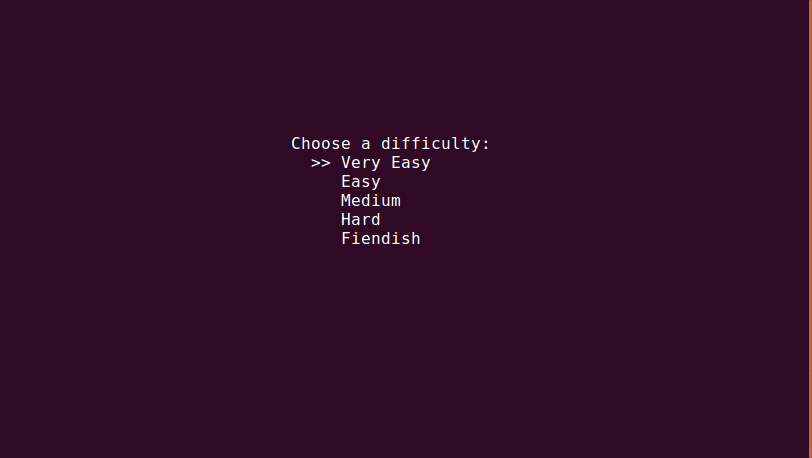

# Sudoku

Play sudoku in terminal

### Controls

Keys | Action
---- | -----
Arrow Keys / wasd / hjkl | Navigation
Number Keys | Fill Cell (0 means empty)
r | Restart current puzzle
u | Undo
Ctr-r | Redo
n | Start a new game
q | Quit
